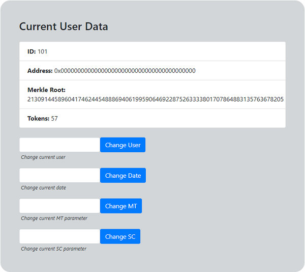

# PoC ENEA - Istruzioni per l'uso

## Endpoints
Dopo aver lanciato il poc sono disponibili i seguenti endpoints:   
- http://localhost:8080 --> pgAdmin, interfaccia web per facilitare la gestione del db
- http://localhost:8081 --> block explorer
- http://localhost:4001 --> dashboard ENEA
- http://localhost:4001/user --> dashboard utente

### PgAdmin
Navigando su http://localhost:8080 per utilizzare pgAdmin si viene reindirizzati a una schermata di login; è necessario infatti autenticarsi prima di poter accedere alla gestione del db. Le credenziali di default sono (possono essere cambiate da `docker-compose.yaml`):
- **user**:  admin@linuxhint.com
- **password** : secret   

### Block Explorer
Nel poc è incluso anche un block explorer locale, raggiungibile all'indirizzo http://localhost:8081. Per visualizzare i dettagli di una transazione o di un indirizzo è sufficiente inserire il dato nella barra di ricerca.

### Dashboard ENEA
La dashboard riservata ad ENEA può essere suddivisa in quattro sezioni principali:
- **General Parameters**: qui vengono riportati i parametri generali attualmente in uso nell'algoritmo per il conteggio dei tokens, cioè    
    - **MT**: numero massimo di tokens assegnabili in una giornata
    - **SC**: soglia di carico il cui superamento comporta una penalizzazione nel numero di tokens ottenibili nel periodo considerato
    - **date**: data selezionata per il conteggio                  
                                      
                 

- **Current User Data**: qui vengono mostrati i parametri relativi all'utente attualmente selezionato
    - **ID**: identificativo dell'utente
    - **address**: address con cui è stato registrato l'utente (0x00...00 se l'utente non è ancora registrato) 
    - **merkle root**: merkle root dei consumi dell'utente corrente calcolato per la giornata attualmente selezionata
    - **tokens**: token calcolati per l'utente corrente nella giornata attualmente selezionata
            
    In questa sezione inoltre sono presenti dei pulsanti che permettono di cambiare i parametri correnti dell'algoritmo: utente, data, MT e SC.       
         

- **Proof**: in questa sezione è possibile generare una Zero-Knowledge Proof che certifica il calcolo effettuato con i parametri attualmente in uso (questo passo è necessario per poter effettuare un minting verificato)
        
 

       
- **On-Chain Actions**: in questa sezione viene mostrata l'ultima transazione effettuata e gli indirizzi dei due contratti `ENEAToken` e `Verifier`. Sono presenti inoltre alcuni input fields per interagire direttamente con gli smart contracts:
    - **register user**: permette di registrare un utente sul contratto `ENEAToken` associandolo ad uno specifico address
    - **mint**: mint classico, permette di generare dei tokens e di inviarli ad un determinato indirizzo
    - **verified mint**: permette di assegnare i token risultanti dal conteggio previa verifica della ZKP (requisiti: 1. la prova deve essere generata prima di effettuare questa azione e 2. l'utente deve essere stato registrato).   
     
    In fondo a questa sezione vengono mostrati i log delle ultime operazioni effettuate on-chain; per ogni transazione viene mostrato un link per visualizzare i relativi dettagli sul block explorer.

 

### Dashboard Utente

#### Setup
Per poter interagire con la dashboard utente è necessario iniettare nella pagina un web3 provider; il metodo più semplice è installare [MetaMask](https://metamask.io/download) come plugin del browser (attualmente i browser supportati sono: Chrome, Firefox, Brave e Edge).

Una volta installato MetaMask è necessario eseguire due step principali prima di poter utilizzare la dashboard utente: collegare MetaMask alla rete locale sostenuta dall'istanza di ganache-cli che gira su uno dei container Docker e importare un account pre-funded.

#### Collegare MetaMask alla rete locale
Aprire MetaMask (dopo l'installazione dovrebbe comparire il logo vicino alla barra degli indirizzi del browser) quindi navigare in *Impostazioni* > *Reti* > *Aggiungi Rete* e inserire i seguenti dati:
* **Nome Rete**: a piacere (per esempio ENEA PoC)
* **Nuovo URL RPC**: http://localhost:8545
* **Chain ID**: 1337
* **Simbolo**: ETH 

A questo punto nella pagina principale del wallet sarà possibile selezionare dal menu a tendina la rete appena inserita.

#### Importare account pre-funded
Gli account pre-fundati da ganache sono i seguenti:

|                 Address                              |                            Private Key                           |
| ---------------------------------------------------- |:----------------------------------------------------------------:|
| **0x90F8bf6A479f320ead074411a4B0e7944Ea8c9C1** (100 ETH) | 4f3edf983ac636a65a842ce7c78d9aa706d3b113bce9c46f30d7d21715b23b1d |
| 0xFFcf8FDEE72ac11b5c542428B35EEF5769C409f0 (100 ETH) | 6cbed15c793ce57650b9877cf6fa156fbef513c4e6134f022a85b1ffdd59b2a1 |
| 0x22d491Bde2303f2f43325b2108D26f1eAbA1e32b (100 ETH) | 6370fd033278c143179d81c5526140625662b8daa446c22ee2d73db3707e620c |
| 0xE11BA2b4D45Eaed5996Cd0823791E0C93114882d (100 ETH) | 646f1ce2fdad0e6deeeb5c7e8e5543bdde65e86029e2fd9fc169899c440a7913 |
| 0xd03ea8624C8C5987235048901fB614fDcA89b117 (100 ETH) | add53f9a7e588d003326d1cbf9e4a43c061aadd9bc938c843a79e7b4fd2ad743 |
| 0x95cED938F7991cd0dFcb48F0a06a40FA1aF46EBC (100 ETH) | 395df67f0c2d2d9fe1ad08d1bc8b6627011959b79c53d7dd6a3536a33ab8a4fd |
| 0x3E5e9111Ae8eB78Fe1CC3bb8915d5D461F3Ef9A9 (100 ETH) | e485d098507f54e7733a205420dfddbe58db035fa577fc294ebd14db90767a52 |
| 0x28a8746e75304c0780E011BEd21C72cD78cd535E (100 ETH) | a453611d9419d0e56f499079478fd72c37b251a94bfde4d19872c44cf65386e3 |
| 0xACa94ef8bD5ffEE41947b4585a84BdA5a3d3DA6E (100 ETH) | 829e924fdf021ba3dbbc4225edfece9aca04b929d6e75613329ca6f1d31c0bb4 |
| 0x1dF62f291b2E969fB0849d99D9Ce41e2F137006e (100 ETH) | b0057716d5917badaf911b193b12b910811c1497b5bada8d7711f758981c3773 |

Per importare un account è sufficiente cliccare sull'immagine profilo dell'account di MetaMask in alto a dx, quindi selezionare *Importa Account* e compilare i campi in questo modo:
* **Seleziona Tipo**: Chiave privata
* **Incolla la tua chiave privata qui**: inserire la private key indicata in tabella in corrispondenza dell'address che si vuole utilizzare

#### Utilizzo

Per poter interagire con la pagina web (dovrebbe essere necessario solo la prima volta che si utilizza un account) è sufficiente connettere MetaMask alla pagina cliccando il tasto "Connect with MetaMask".   
In caso di lanci consecutivi dell'infrastruttura MetaMask potrebbe avere dei ritardi nell'aggiornare gli account salvati al suo interno (i containers Docker ricreano la blockchain locale con gli stessi account pre-funded ma ovviamente cambiano i nonces); nel caso in cui dovessero comparire nella schermata dei dati errati, si consiglia di switchare rete su MetaMask per poi tornare su quella del poc in modo da forzare un refresh generale del network.  

La schermata è suddivisa in due sezioni principali:
- **User Infos**: contiene alcune informazioni relative all'utente, in particolare
    - **ID utente**
    - **address utente**
    - **saldo ENEAToken**   
         
 

- **Verified Mintings**: è dedicata ai verified mintings effettuati per l'utente corrente; è composta da due sottosezioni 
    - **Dates**: date per cui l'utente ha dei verified mintings
    - **Details**: contiene un input field in cui è possibile inserire la data di un verified minting per visualizzarne i dettagli (la data va inserita nel formato YYYY-mm-dd)

